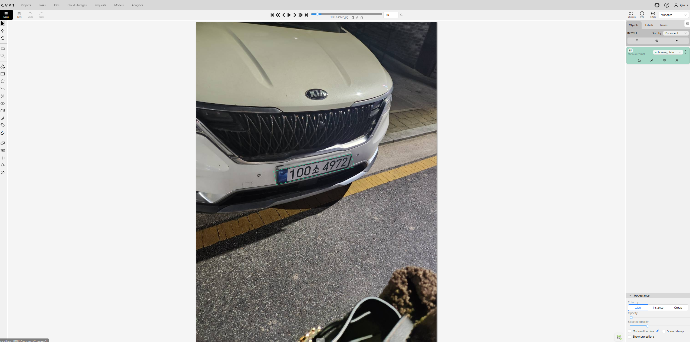
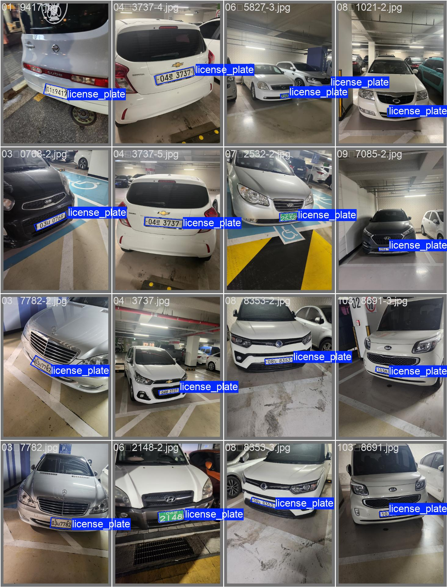
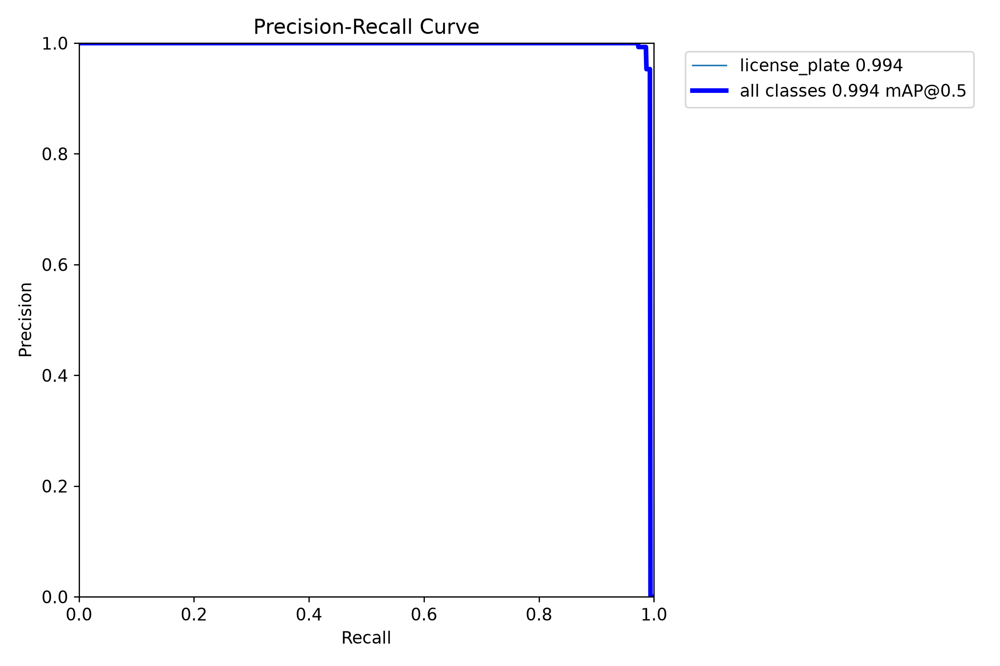
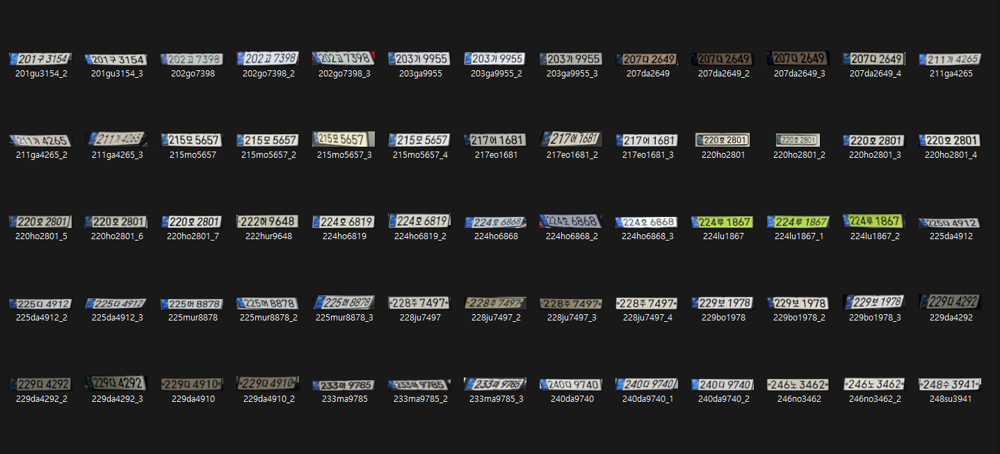
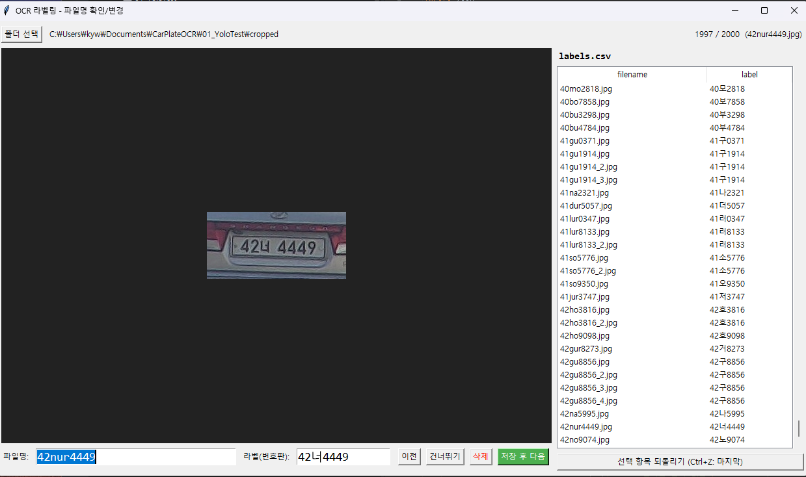
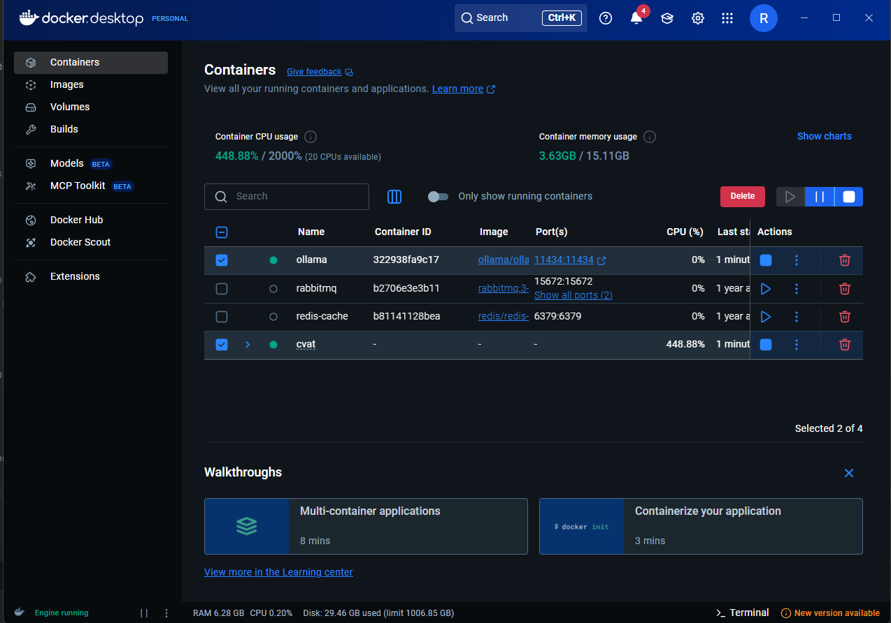

\# AI License Plate Recognition System


> 본 저장소는 차량번호판 인식 프로젝트의 설계, 학습 과정 및

> 성능 검증 결과를 정리한 포트폴리오용 저장소입니다.

> 학습 데이터, 모델 가중치 및 전체 소스 코드는 포함하지 않습니다.


YOLO11 OBB, Fine-tuned PaddleOCR, OpenCV, Qwen-VL을 결합하여 구현한  

\*\*AI 기반 차량번호판 인식 시스템\*\*입니다.


차량 이미지에서 번호판 위치를 검출하고, 기울어진 번호판을 정면 형태로 보정한 뒤 문자열을 인식합니다.


PaddleOCR의 인식 신뢰도가 낮거나 번호판 형식 검증에 실패한 경우에만 Ollama 기반 Qwen-VL을 호출하는 \*\*선택적 VLM 폴백 구조\*\*를 적용했습니다.


\---


\## Project Overview


비전 AI에 관심을 가지고 YOLO, OpenCV, OCR 모델을 학습한 뒤, 학습한 내용을 실제 결과물로 연결하기 위해 진행한 개인 프로젝트입니다.


단순히 공개 모델을 실행하는 수준을 넘어 다음 과정을 직접 수행했습니다.


\- 차량 이미지 수집

\- CVAT 기반 번호판 OBB 라벨링

\- YOLO11 OBB 파인튜닝

\- 번호판 Crop 및 원근 보정

\- OCR 학습 데이터 구축

\- PaddleOCR Recognition 파인튜닝

\- 번호판 형식 기반 후처리

\- Ollama Qwen-VL 폴백 처리

\- 전체 배포 파이프라인 성능 검증


\---


\## Key Results


| 평가 항목 | 결과 |

|---|---:|

| 전체 파이프라인 검증 이미지 | 199장 |

| 전체 Exact Match 정확도 | \*\*170 / 199, 85.4%\*\* |

| VLM 폴백 발생 | 38 / 199, 19.1% |

| VLM 폴백 구간 정확도 | 26 / 38, 68.4% |

| YOLO11 OBB Precision | 0.993 |

| YOLO11 OBB Recall | 0.985 |

| YOLO11 OBB mAP@0.5 | \*\*0.994\*\* |

| YOLO11 OBB mAP@0.5:0.95 | 0.948 |

| OCR 학습 데이터 | 약 2,000장 |


> YOLO mAP는 번호판 영역을 검출하는 성능이며,  

> 전체 Exact Match는 최종 번호판 문자열 전체를 정확하게 인식한 비율입니다.


\---


\## System Pipeline


```text

차량 이미지 입력

&#x20;   ↓

YOLO11 OBB 번호판 검출

&#x20;   ↓

OBB 좌표 기반 번호판 Crop

&#x20;   ↓

OpenCV 원근 보정 Rectification

&#x20;   ↓

Fine-tuned PaddleOCR 문자 인식

&#x20;   ↓

OCR Confidence 및 번호판 형식 검증

&#x20;   ↓

저신뢰 결과만 Ollama Qwen-VL 폴백

&#x20;   ↓

후처리 및 최종 번호판 문자열 출력

```


각 모델의 역할은 다음과 같이 분리했습니다.


| 구성 요소 | 역할 |

|---|---|

| YOLO11 OBB | 기울어진 번호판 위치 검출 |

| OpenCV | 번호판 Crop, 회전 및 원근 보정 |

| PaddleOCR | 빠른 1차 번호판 문자열 인식 |

| 번호판 규칙 검사 | 문자열 형식 및 허용 문자 검증 |

| Qwen-VL | 저신뢰 번호판 이미지 2차 판독 |

| Ollama | 로컬 VLM 실행 환경 |


\---


\## Why YOLO OBB?


일반적인 YOLO Bounding Box는 수평·수직 사각형으로 객체를 검출합니다.


하지만 차량번호판은 촬영 위치와 차량 방향에 따라 기울어지거나 사선 형태로 나타나는 경우가 많습니다.


일반 Bounding Box를 사용하면 번호판 주변의 범퍼나 배경 영역이 함께 포함될 수 있고, 이는 OCR 정확도 저하로 이어질 수 있습니다.


따라서 네 개의 꼭짓점을 사용하여 회전된 객체를 검출할 수 있는 \*\*YOLO11 OBB 모델\*\*을 적용했습니다.


\---


\## Dataset Annotation


라벨링 도구는 CVAT를 사용했습니다.


\### Export Format


```text

Ultralytics YOLO Oriented Bounding Boxes 1.0

```


\### OBB Label Format


```text

class x1 y1 x2 y2 x3 y3 x4 y4

```


예시:


```text

0 0.393323 0.406877 0.632610 0.440139 0.620134 0.490623 0.380848 0.457361

```


번호판 클래스 하나만 사용했습니다.


```yaml

names:

&#x20; 0: license\_plate

```


라벨링 시 번호판 주변의 차량 범퍼나 배경이 과도하게 포함되지 않도록 번호판 외곽에 최대한 밀착하여 작업했습니다.


\---


\## YOLO Dataset Structure


CVAT에서 Export한 데이터를 학습용과 검증용으로 분리했습니다.


```text

dataset/

├── images/

│   ├── train/

│   └── val/

├── labels/

│   ├── train/

│   └── val/

└── data.yaml

```


\### data.yaml


```yaml

path: .

train: images/train

val: images/val


names:

&#x20; 0: license\_plate

```


Train과 Validation 데이터는 약 80:20 비율로 분리했습니다.


\---


\## YOLO Training Environment


Windows 환경에서 Python 가상환경을 생성하고 CUDA용 PyTorch와 Ultralytics를 설치했습니다.


```powershell

cd C:\\Users\\kyw\\Downloads\\dataset


py -3.12 -m venv .venv

.\\.venv\\Scripts\\Activate.ps1


python -m pip install --upgrade pip


pip install torch torchvision torchaudio --index-url https://download.pytorch.org/whl/cu128

pip install ultralytics

```


GPU 동작 확인:


```powershell

python -c "import torch; print(torch.cuda.is\_available()); print(torch.cuda.get\_device\_name(0))"

```


사용 GPU:


```text

NVIDIA GeForce RTX 4070 SUPER

```


\---


\## YOLO Training


사전 학습된 `yolo11n-obb.pt`를 기반으로 번호판 데이터셋을 추가 학습했습니다.


```powershell

python -c "from ultralytics import YOLO; model=YOLO('yolo11n-obb.pt'); model.train(data='data.yaml', epochs=100, imgsz=640, batch=16, patience=20, device=0)"

```


주요 학습 설정:


| 설정 | 값 |

|---|---:|

| Base Model | YOLO11n-OBB |

| Epochs | 100 |

| Image Size | 640 |

| Batch Size | 16 |

| Patience | 20 |

| Device | CUDA GPU |


Early Stopping을 적용하여 일정 기간 동안 검증 성능이 개선되지 않으면 학습이 자동으로 종료되도록 설정했습니다.


\---


\## YOLO Detection Result


검증 결과는 다음과 같습니다.


| Metric | Result |

|---|---:|

| Validation Images | 138 |

| Instances | 143 |

| Precision | 0.993 |

| Recall | 0.985 |

| mAP@0.5 | \*\*0.994\*\* |

| mAP@0.5:0.95 | 0.948 |


Best Model:


```text

runs/obb/train-3/weights/best.pt

```


`best.pt`는 학습 중 검증 성능이 가장 좋았던 Epoch의 모델이며 실제 추론 파이프라인에 사용했습니다.


\### Inference


```powershell

python -c "from ultralytics import YOLO; model=YOLO('runs/obb/train-3/weights/best.pt'); model.predict(source='images/val', conf=0.25, save=True)"

```


결과는 기본적으로 다음 경로에 저장됩니다.


```text

runs/obb/predict/

```


\---


\## License Plate Rectification


YOLO OBB가 반환한 네 개의 꼭짓점을 이용해 번호판 이미지만 추출했습니다.


처리 순서는 다음과 같습니다.


```text

OBB 꼭짓점 좌표 추출

&#x20;   ↓

좌상단, 우상단, 우하단, 좌하단 순서로 정렬

&#x20;   ↓

출력 이미지의 가로와 세로 크기 계산

&#x20;   ↓

Perspective Transform Matrix 생성

&#x20;   ↓

cv2.warpPerspective 적용

```


핵심 OpenCV 함수:


```python

transform\_matrix = cv2.getPerspectiveTransform(src\_points, dst\_points)


rectified = cv2.warpPerspective(

&#x20;   image,

&#x20;   transform\_matrix,

&#x20;   (target\_width, target\_height)

)

```


단순 Bounding Box Crop이 아니라 번호판의 기울기와 원근을 보정하여 OCR이 읽기 쉬운 정면 이미지로 변환했습니다.


\---


\## OCR Dataset


YOLO 학습 데이터와 OCR 학습 데이터는 서로 다른 라벨 구조를 사용합니다.


YOLO는 번호판 위치 좌표가 필요하지만, OCR Recognition 모델은 다음 두 정보가 필요합니다.


```text

번호판 Crop 이미지 + 실제 번호판 문자열

```


예시:


```text

train/plate\_001.jpg    서울용산타1214

train/plate\_002.jpg    68오8269

train/plate\_003.jpg    123가4567

```


CSV 형태로 관리할 경우:


```csv

filename,label

40mo2818.jpg,40모2818

41gu1914.jpg,41구1914

42nur4449.jpg,42너4449

```


파일명에는 영문과 숫자를 사용하고, 실제 한글 번호판 문자열은 `label` 컬럼에 저장했습니다.


\---


\## OCR Labeling Tool


약 2,000장의 번호판 Crop 이미지를 효율적으로 검수하기 위해 OCR 라벨링 프로그램을 직접 제작했습니다.


지원 기능:


\- 이미지 폴더 선택

\- 번호판 이미지 미리보기

\- 파일명 수정

\- 정답 문자열 입력

\- 이전 이미지 이동

\- 이미지 건너뛰기

\- 잘못된 이미지 삭제

\- 저장 후 다음 이미지 이동

\- CSV 라벨 목록 확인

\- 최근 변경 항목 되돌리기


반복적인 데이터 검수 작업을 파일 탐색기와 Excel로 수행하지 않고 하나의 프로그램에서 처리할 수 있도록 구성했습니다.


\---


\## Fine-tuned PaddleOCR


번호판 문자열 인식에는 PaddleOCR Recognition 모델을 사용했습니다.


기본 사전 학습 모델을 그대로 사용하는 것이 아니라 직접 구축한 국내 번호판 Crop 이미지와 정답 문자열을 사용하여 추가 학습했습니다.


학습 데이터에는 다음과 같은 조건을 포함했습니다.


\- 일반 흰색 번호판

\- 녹색 구형 번호판

\- 파란색 영역이 포함된 번호판

\- 원거리에서 촬영된 번호판

\- 어두운 환경의 번호판

\- 빛 반사가 발생한 번호판

\- 기울어지거나 원근 왜곡이 있는 번호판

\- 일부 문자가 흐린 번호판

\- 동일 차량을 서로 다른 거리와 각도에서 촬영한 이미지


\---


\## Plate Format Validation


PaddleOCR 결과를 그대로 사용하지 않고 번호판 문자열 형식과 허용 문자를 검사했습니다.


일반적인 번호판의 예시는 다음과 같습니다.


```text

12가3456

68오8269

100소4972

```


기본적인 형식 검증 예시:


```python

import re


plate\_pattern = re.compile(r"^\\d{2,3}\[가-힣]\\d{4}$")


def is\_valid\_plate(text: str) -> bool:

&#x20;   return bool(plate\_pattern.fullmatch(text))

```


다음 조건에 해당하면 저신뢰 결과로 분류할 수 있습니다.


\- PaddleOCR Confidence가 기준값 미만인 경우

\- 문자열 길이가 번호판 형식과 맞지 않는 경우

\- 한글 위치에 숫자가 포함된 경우

\- 숫자 위치에 한글 또는 특수문자가 포함된 경우

\- 허용하지 않은 문자가 포함된 경우

\- 번호판 정규식 검증에 실패한 경우


구형 번호판이나 특수 차량 번호판을 처리하기 위해 번호판 유형별 검증 규칙으로 확장할 수 있도록 구성했습니다.


\---


\## Ollama Qwen-VL Fallback


모든 번호판 이미지를 VLM으로 처리하지 않고, PaddleOCR 결과가 불확실한 경우에만 Qwen-VL을 호출하도록 구현했습니다.


```text

PaddleOCR 결과 신뢰도 높음

&#x20;   → 최종 결과 반환


PaddleOCR 결과 신뢰도 낮음

또는 번호판 형식 검증 실패

&#x20;   → Qwen-VL 폴백

&#x20;   → 번호판 형식 후처리

&#x20;   → 최종 결과 반환

```


VLM 프롬프트 예시:


```text

이미지에 보이는 대한민국 차량번호판의 문자열만 출력하세요.

설명이나 문장은 출력하지 마세요.

공백과 특수문자는 제거하세요.

판독할 수 없는 경우에는 '인식불가'라고 출력하세요.

```


Ollama는 Docker 컨테이너로 실행했습니다.


```text

Ollama Port: 11434

VLM: Qwen-VL

```


선택적 폴백 구조를 적용한 이유는 다음과 같습니다.


\- 일반 번호판은 PaddleOCR로 빠르게 처리

\- 저신뢰 이미지만 VLM으로 추가 판독

\- 불필요한 GPU 및 메모리 사용 감소

\- 전체 응답 시간 증가 최소화

\- 어려운 이미지에 추가 인식 기회 제공


\---


\## Full Pipeline Evaluation


실제 배포 구조와 동일한 전체 파이프라인을 199개의 검증 이미지로 평가했습니다.


평가 대상:


```text

YOLO OBB Detection

\+ License Plate Rectification

\+ Fine-tuned PaddleOCR

\+ Plate Format Validation

\+ Ollama Qwen-VL Fallback

```


평가 스크립트:


```text

04\_Carplate/evaluate.py

```


\### Exact Match


번호판 문자열 전체가 정답과 완전히 일치한 경우에만 정답으로 처리했습니다.


```text

Ground Truth: 100소4972

Prediction:   100소4972

Result:       Correct

```


```text

Ground Truth: 100소4972

Prediction:   100소4973

Result:       Incorrect

```


숫자나 한글 한 글자만 달라도 오답으로 처리했습니다.


\### Evaluation Result


```text

Total Images:     199

Correct:          170

Incorrect:         29

Exact Match:      85.4%

```


VLM 폴백 결과:


```text

Fallback Calls:       38 / 199

Fallback Rate:        19.1%

Fallback Correct:     26 / 38

Fallback Accuracy:    68.4%

```


| 처리 구간 | 이미지 | 정답 | 정확도 |

|---|---:|---:|---:|

| OCR 및 후처리 구간 | 161 | 144 | 89.4% |

| VLM 폴백 구간 | 38 | 26 | 68.4% |

| 전체 파이프라인 | 199 | 170 | \*\*85.4%\*\* |


VLM 폴백 구간은 OCR Confidence가 낮거나 번호판 형식 검사에 실패한 상대적으로 어려운 이미지들입니다.


현재 수치는 전체 파이프라인과 VLM 폴백 구간의 성능을 나타내며, VLM 적용 전후의 순수 개선 폭은 별도의 비교 평가로 측정할 예정입니다.


\---


\## PaddleOCR-Only Evaluation


PaddleOCR Recognition 모델 자체의 성능은 별도 평가 스크립트로 측정합니다.


```text

03\_PaddleOCR/evaluate.py

```


두 평가의 차이는 다음과 같습니다.


| 평가 스크립트 | 평가 대상 |

|---|---|

| `03\_PaddleOCR/evaluate.py` | Crop된 번호판 이미지에 대한 OCR 모델 단독 성능 |

| `04\_Carplate/evaluate.py` | Detect, Rectify, OCR, VLM을 포함한 전체 파이프라인 성능 |


따라서 OCR 모델 단독 정확도와 실제 프로그램 전체 정확도는 서로 다른 지표입니다.


\---


\## Error Analysis


전체 오답은 29장이었으며, 주요 오류는 한글 문자 혼동과 숫자 오인식이었습니다.


\### Korean Character Confusion


```text

서 → 8서

무 → 부

보 → 조

```


번호판 볼트, 테두리, 반사광 또는 낮은 해상도로 인해 한글의 일부 획이 다른 문자나 숫자로 인식되는 문제가 발생했습니다.


\### Number Confusion


```text

0 ↔ 8

1 ↔ 7

3 ↔ 8

5 ↔ 6

```


빛 반사나 이미지 압축으로 숫자의 일부 획이 사라지는 경우 유사한 숫자로 인식됐습니다.


\### Extra Character


번호판 테두리, 볼트, 오염 또는 그림자가 추가 문자로 인식되는 사례도 확인했습니다.


```text

서 → 8서

```


\---


\## Project Structure


실제 디렉터리 구성에 맞게 경로는 변경될 수 있습니다.


```text

.

├── dataset/

│   ├── images/

│   │   ├── train/

│   │   └── val/

│   ├── labels/

│   │   ├── train/

│   │   └── val/

│   └── data.yaml

│

├── 03\_PaddleOCR/

│   ├── train/

│   ├── evaluate.py

│   └── labels.csv

│

├── 04\_Carplate/

│   ├── evaluate.py

│   ├── detector.py

│   ├── rectifier.py

│   ├── ocr\_service.py

│   └── vlm\_service.py

│

├── runs/

│   └── obb/

│       └── train-3/

│           └── weights/

│               └── best.pt

│

├── docs/

│   └── images/

│

├── requirements.txt

└── README.md

```


> 위 구조에서 실제 저장소에 존재하지 않는 파일명은 현재 프로젝트 구조에 맞게 수정해야 합니다.


\---


\## Installation


```powershell

git clone https://github.com/youngwoo95/REPOSITORY\_NAME.git

cd REPOSITORY\_NAME


py -3.12 -m venv .venv

.\\.venv\\Scripts\\Activate.ps1


pip install -r requirements.txt

```


Ollama 컨테이너 또는 로컬 Ollama 서버가 실행 중이어야 합니다.


기본 연결 주소:


```text

http://localhost:11434

```


\---


\## Run Evaluation


PaddleOCR 모델 단독 평가:


```powershell

python 03\_PaddleOCR/evaluate.py

```


전체 번호판 인식 파이프라인 평가:


```powershell

python 04\_Carplate/evaluate.py

```


실제 경로, 모델 파일, 데이터셋 경로 및 Ollama 주소는 프로젝트 설정 파일에 맞게 수정해야 합니다.


\---


\## Screenshots


## CVAT OBB Annotation



## YOLO11 OBB Detection Result



## Precision-Recall Curve



## Rectified License Plate Dataset



## OCR Labeling Tool



## Ollama VLM Environment




\---


\## Limitations


현재 확인된 한계는 다음과 같습니다.


\- 한글 한 글자의 작은 획이 손실될 경우 인식 오류 발생

\- 원거리 번호판의 해상도가 매우 낮으면 OCR과 VLM 모두 실패할 수 있음

\- 빛 반사와 번호판 볼트가 문자로 인식될 수 있음

\- 번호판 유형별 형식 검증 규칙이 추가로 필요함

\- VLM 폴백은 PaddleOCR보다 처리 시간이 길고 더 많은 자원을 사용함

\- 현재 검증 데이터가 199장으로 제한되어 있어 더 큰 외부 데이터셋 검증이 필요함


\---


\## Future Work


\- VLM 적용 전후의 정확도 비교

\- OCR Confidence 임계값 최적화

\- 한글 혼동 문자 후처리 강화

\- 번호판 종류별 정규식 및 허용 문자 사전 구축

\- Blur, Noise, Perspective, Brightness 데이터 증강

\- 더 많은 독립 검증 데이터 확보

\- 영상 입력 및 실시간 번호판 추적

\- 동일 차량 중복 인식 방지

\- ASP.NET Core API와 Python 추론 서버 연동

\- ONNX 또는 TensorRT 기반 추론 최적화

\- 처리 시간, GPU 사용량 및 평균 응답 시간 측정


\---


\## What I Learned


이 프로젝트를 통해 모델 성능은 모델 자체뿐 아니라 전체 데이터와 전처리 품질에 크게 영향을 받는다는 점을 확인했습니다.


특히 다음 요소가 최종 번호판 인식 정확도에 중요한 영향을 미쳤습니다.


\- 정확한 OBB 라벨링

\- 번호판 외곽에 밀착된 Crop

\- OBB 꼭짓점 좌표 정렬

\- 원근 보정 결과

\- OCR 데이터의 다양성

\- 한글 및 숫자 문자 사전

\- 번호판 형식 기반 후처리

\- Confidence 임계값

\- OCR과 VLM의 역할 분리

\- 모델 단독 평가와 전체 시스템 평가의 구분


단일 모델이 모든 처리를 담당하도록 구성하기보다, 빠른 OCR 모델과 상대적으로 무거운 VLM을 단계적으로 결합하여 정확도와 처리 비용을 함께 고려한 시스템을 설계했습니다.


\---


\## Tech Stack


\- Python

\- PyTorch

\- Ultralytics YOLO11 OBB

\- PaddleOCR

\- OpenCV

\- Qwen-VL

\- Ollama

\- Docker

\- CVAT

\- NVIDIA CUDA


\---


\## Model Files


학습된 모델 파일은 용량이 클 수 있으므로 일반 Git Commit 대신 다음 방법을 권장합니다.


\- Git LFS

\- GitHub Release

\- 외부 모델 스토리지


```text

runs/obb/train-3/weights/best.pt

```


학습 데이터에 실제 차량번호가 포함되어 있다면 개인정보 및 데이터 공개 범위를 검토한 뒤 업로드해야 합니다.


\---


\## Author


\- GitHub: \[youngwoo95](https://github.com/youngwoo95)


